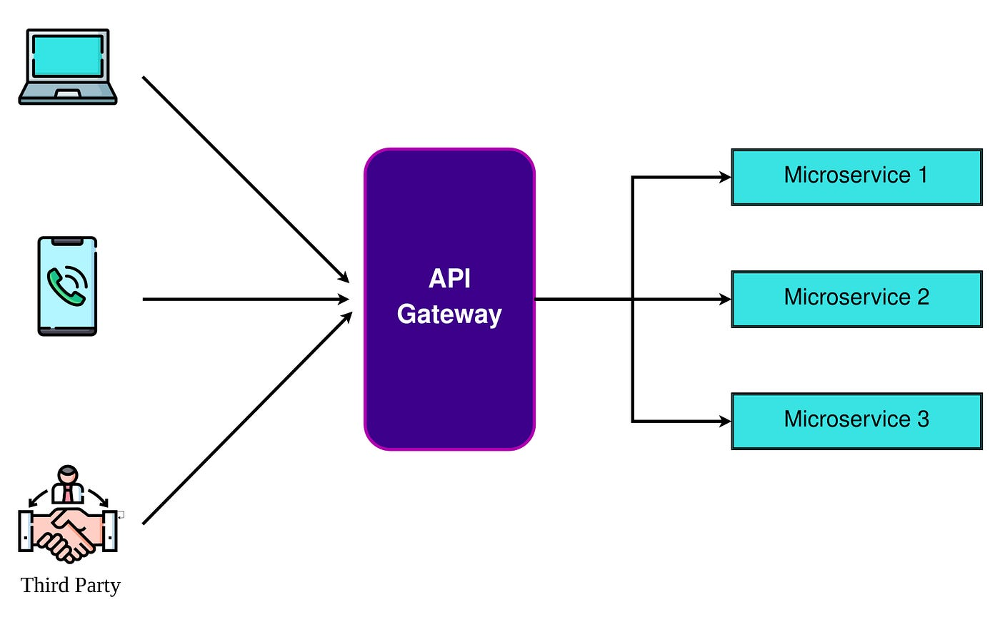

# OpenResty Redis Circuit Breaker API Gateway

A lightweight API gateway built with OpenResty (NGINX + Lua) that protects requests from Redis outages using a circuit breaker pattern.

## Architecture

**API Gateway Overview:**



**Circuit Breaker State Transitions:**

```
┌──────────┐
│  CLOSED  │  ◄─── Normal operation, Redis is healthy
└────┬─────┘
  │ failures exceed threshold
  ▼
┌──────────┐
│   OPEN   │  ◄─── Redis unavailable, requests fail fast
└────┬─────┘
  │ cooldown period expires
  ▼
┌──────────────┐
│  HALF-OPEN   │  ◄─── Testing if Redis recovered
└────┬─────┬───┘
  │     │
success│     │failure
  ▼     ▼
  CLOSED   OPEN
```

## Features

### Available Endpoints

| Endpoint | Purpose |
|----------|---------|
| `GET /health` | Health check (no Redis required) |
| `GET /protected` | Redis-protected route with circuit breaker |
| `GET /stats` | Metrics and circuit breaker status (JSON) |

### Circuit Breaker States

| State | Behavior |
|-------|----------|
| **CLOSED** | Normal operation - Redis calls are made |
| **OPEN** | Redis unavailable - requests fail fast without Redis calls |
| **HALF_OPEN** | Testing recovery - limited probe requests sent to Redis |

### Response Headers (Observability)

- `X-CB-State`: Current circuit breaker state
- `X-CB-Fails`: Count of consecutive failures
- `X-CB-Fallback`: Reason for fallback response
- `X-Redis`: Redis error message (if any)

## Requirements

- Docker (recommended) or Podman

## Quick Start

### 1. Clone the Repository

```bash
git clone https://github.com/VijayR19/OpenResty-Redis-Circuit-Breaker-Gateway.git
cd OpenResty-Redis-Circuit-Breaker-Gateway
```

### 2. Start Redis

```bash
docker run -d -p 6379:6379 redis:latest
```

## Testing the Gateway

### Health Check

```bash
curl -i http://localhost:8080/health
```

### Protected Endpoint

```bash
curl -i http://localhost:8080/protect
```

**Expected Response Headers:**
- `X-CB-State: closed`
- `X-Redis: pong`

### View Statistics

```bash
curl -s http://localhost:8080/stats
```

**Example Response:**
```json
{
  "state": "closed",
  "fails": 0,
  "calls": 5,
  "redis_ok": 5,
  "redis_fail": 0
}
```

## Demo: Trip the Circuit Breaker

### Step 1: Stop Redis

```bash
docker stop redis
```

### Step 2: Make Multiple Requests

```bash
for i in {1..5}; do curl -i http://localhost:8080/protect; done
```

**Expected Behavior:**
- `X-CB-State: open` (circuit is now open)
- Redis calls are skipped
- Gateway remains responsive despite Redis being down

## Demo: Recovery

### Step 1: Restart Redis and Wait

```bash
docker start redis
sleep 6   # Wait for cooldown period
```

### Step 2: Test Recovery

```bash
curl -i http://localhost:8080/protect
```

The circuit breaker will transition back to `CLOSED` after Redis responds successfully.

## Why This Matters

✓ **Resilience at gateway level** - no application code changes needed  
✓ **Shared state** - circuit breaker state is consistent across all requests  
✓ **Graceful degradation** - Redis failures don't crash the gateway  
✓ **Production-ready patterns** - real-world OpenResty + Lua implementation  

